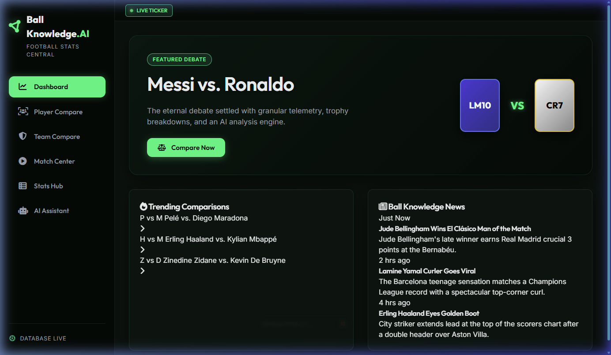
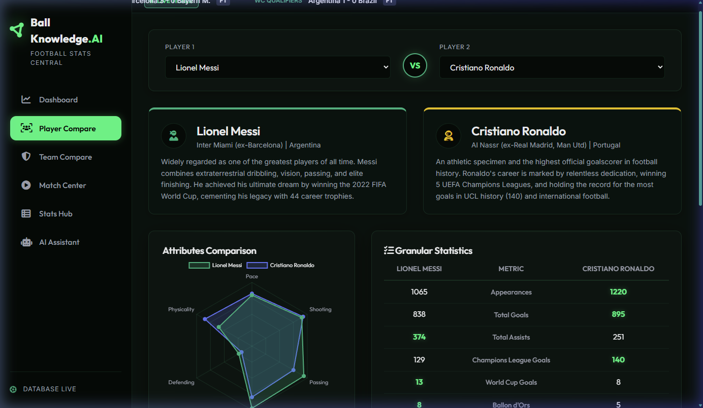
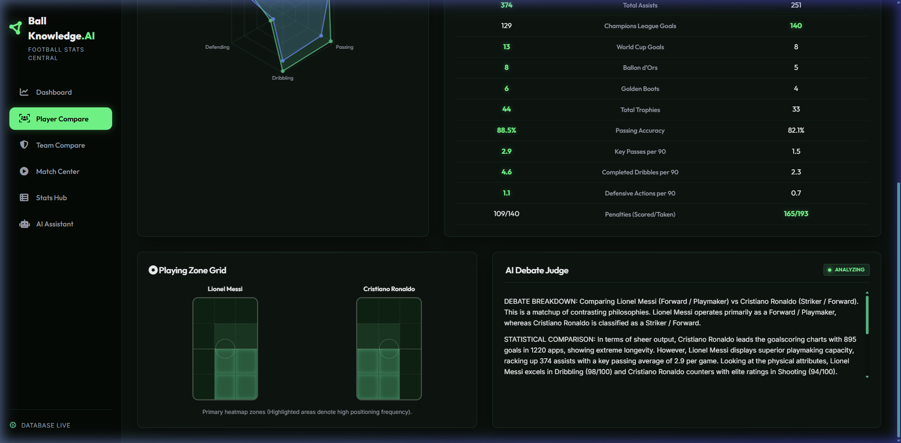
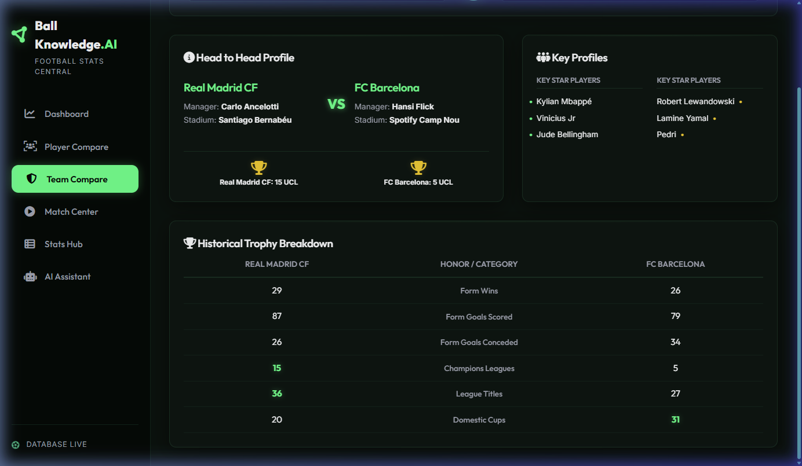
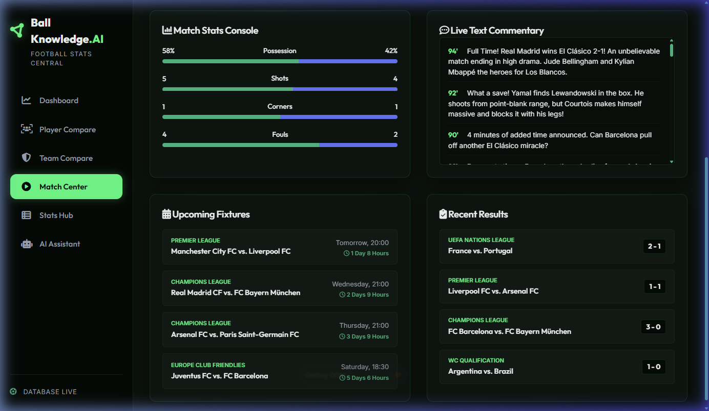
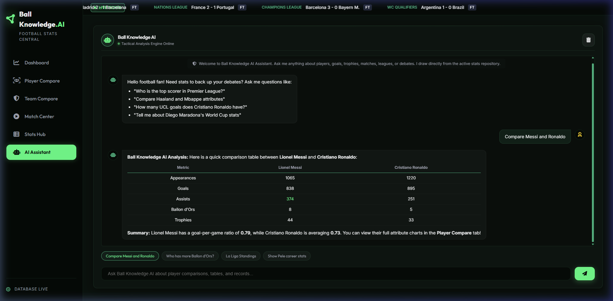

# Ball Knowledge - Football Stats AI Hub ⚽🤖

**Ball Knowledge** is a premium, feature-rich web application designed as a centralized repository for football fans. It provides comprehensive statistics, interactive comparisons of players and teams (including current stars and legends), live match simulations with real-time text commentary, and a simulated **Football Stats AI Assistant** to answer stats-related queries and settle football debates with facts.

Featuring a dark emerald pitch-green aesthetic, glassmorphism card layouts, and responsive interfaces, this application serves as the ultimate hub for football lovers.

---

## 📸 Screenshots & Visuals

### 1. Dashboard Overview
A modern pitchside HUD showcasing featured debates, trending player comparisons, and a ticker displaying live scorelines.

### 2. Player & Legend Compare (The Debate Settler)
Select any two current stars or historical legends to compare their stats, inspect their attribute radar charts, see their positioning heatmaps, and read the AI Debate Judge analysis.

### 3. AI Debate Judge
An AI console that parses selected statistics and generates a typewriter-animated write-up comparing playstyles and delivering a neutral verdict.

### 4. Team & Country Compare
Inspect managers, home stadiums, squads, and side-by-side graphical trophy cabinet counts.

### 5. Live Match Center & Commentary Console
Connects directly to ESPN's public live feeds to show real-life schedules and live scores, defaulting to the active FIFA World Cup tournament. Includes live possession/shot statistics, card notifications, and reverse-chronological match commentaries.

### 6. Conversational AI Stats Assistant
A messaging chat window where fans can ask queries (e.g., "compare Pele and Maradona" or "La Liga Standings") and get responses formatted in clean HTML tables.

---

## 🌟 Key Features

1. **Detailed Player Database**: Granular stats (appearances, goals, assists, UCL records, World Cup milestones, pass accuracy, dribbles, and defensive actions) for current stars (Messi, Ronaldo, Haaland, Mbappé, Salah, De Bruyne) and legends (Pelé, Maradona, Cruyff, Zidane, Ronaldinho, R9).
2. **Interactive Radar Charts**: Leverages Chart.js to compare technical scores across Pace, Dribbling, Shooting, Physicality, Defending, and Passing.
3. **Playing Zone Heatmaps**: Vector grids that programmatically light up based on the selected player's positioning preferences.
4. Real-time Match Center HUD: Integrates live ESPN API feeds for the FIFA World Cup, Premier League, La Liga, and Champions League, pulling live scores, clock timings, event cards, and commentaries.
5. Stats Hub: Renders table standings for the Premier League and La Liga, along with top scorer and assist leaderboards.
6. **Robust NLP Parser**: A rule-based assistant matching user text questions to retrieve precise statistics.

---

## 🛠️ GitHub Actions CI Workflow

This repository includes a pre-configured GitHub Actions workflow located in `.github/workflows/ci.yml`. On every `push` and `pull_request` to the main branch, this workflow will:
- Spin up an Ubuntu runner.
- Checkout the repository code.
- Run code presence checks on critical assets (`index.html`, `style.css`, scripts) to guarantee zero deployment failures.

---

## 🚀 How to Run Locally

Since the application uses ES6 JavaScript Modules (`import`/`export`), it must be served via a local HTTP server to avoid CORS issues:

1. Clone this repository to your machine.
2. Open terminal in the `Ball Knowledge` project directory.
3. Start a local HTTP server:
   - **Python**: `python -m http.server 8000`
   - **Node.js**: `npx serve` or `npx live-server`
4. Open your web browser and navigate to `http://localhost:8000/`.
